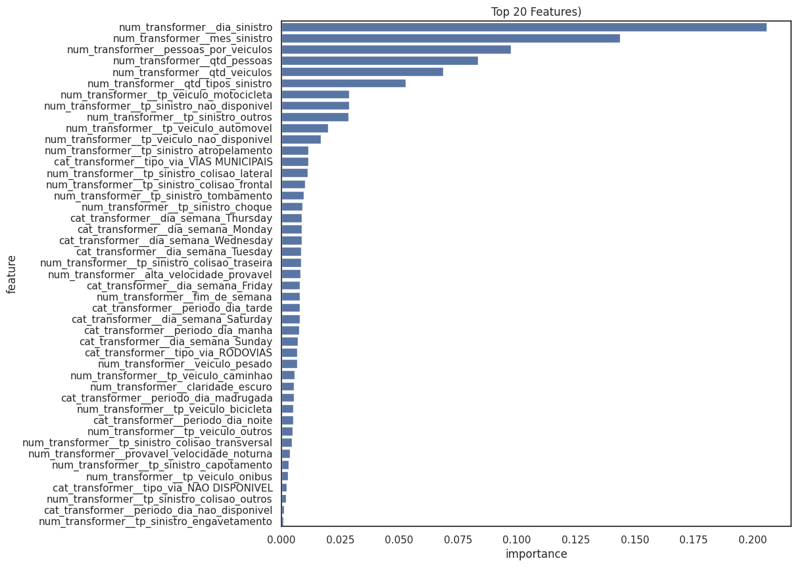
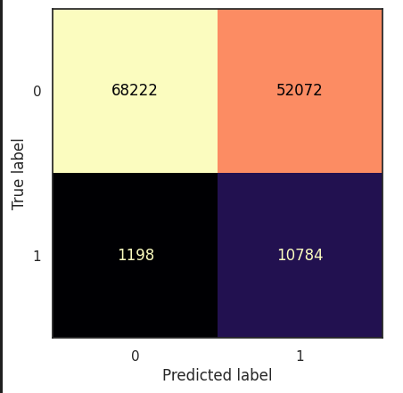

# Predição de Gravidade em Acidentes
## Introdução
Este projeto utiliza Machine Learning para prever a gravidade de acidentes em vias municipais e rodovias, classificando-os entre *'leves/não graves'* e *'graves/fatal'*.

 O objetivo principal é criar uma ferramenta de previsão, que, com base nas informações oferecidas sobre o acidente, auxilie na alocação de recursos de emergência e permita uma futura análise para identificação dos principais fatores que contribuem para a letalidade no trânsito de São Paulo.
## Setup
### Linguagem
- Python 3.13+

### Dependências
- **Manipulação de Dados**: Pandas, Numpy, scipy
- **Machine Learning**: Scikit-Learn
- **Visualização**: Matplotlib, Seaborn
- **Logs das Métricas**: mlflow

## Estrutura
```
predict_sinistro/
│
├── data_sample/ -> sample dos dados     
├── assets/      -> imagens para o README.md     
├── notebooks/   
│   ├── exploration.ipynb -> notebook com todo o passo-a-passo, raciocínio, gráficos      
├── src/                
│   ├── preprocess.py -> funções de limpeza e criação de colunas     
│   ├── predict.py -> aplicação com dados novos     
│   └── train.py -> todo o processo de treinamento (split, pipeline, modelo, logs das métricas)
├── README.md             
└── requirements.txt            
```
## Dados
Os dados utilizados neste projeto podem ser obtidos no Portal de Dados Abertos do Governo do Estado do São Paulo através do link a seguir:
https://dadosabertos.sp.gov.br/dataset/sinistros-infosiga.

Como o objetivo é prever a gravidade de acidentes, o target escolhido foi a junção das colunas 'gravidade_grave' e 'gravidade_fatal', resultando na coluna 'acidente_grave', todas tendo valores binários (0 e 1).

Para o treinamento do modelo será usadas apenas as features que possuem maior impacto para o resultado. Para obter as melhores foi utilizado o método *selectkbest* do módulo *feature_selection* da biblioteca *scikit-learn*.

## Modelo
O algoritmo utilizado foi o **Random Forest** pelo fato dele ser excelente em lidar com dados desbalanceados, não-lineares, outliers, distribuições de cauda longa e assimétricas.
Por ele ser um método de ensemble, o risco de overfitting diminui, através da técnica de amostragens aleatórias, garantindo a generalização dos dados.

Foi utilizado GridSearchCV após o RandomizedSearchCV com a finalidade de achar os melhores hiperparâmetros, priorizando o f1-score, garantindo que o foco não esteja apenas no **Recall**, mas que o **Precision** tenha um valor aceitável.

Para uma otimização foi feito a escolha das 20 melhores features através do SelectKBest, removendo as que não possuem relevância para o modelo, fazendo com que a performance melhore.


## Resultados
|- | Baseline | Hiperparâmetros ajustados |
|:-|:-:|-:|
| Recall | 0.320 | 0.907|
| Precision | 0.490 | 0.177 |
| auc-pr | 0.460 | 0.522 |
| f1-score | 0.388 | 0.295

*Os valores da baseline possuem um threshold de 0.5

O auc-pr apesar de ser um valor baixo, para este modelo é um bom resultado, visto que os dados de resposta são desbalanceados (em torno de 90% de 0's para 10% de 1's)

O valor do threshold adotado foi aproximadamente 0.325 para que o recall pudesse se manter próximo de 0.9 e o precision não ser um valor tão baixo.

Manter o recall em 0.9 garante que 90% dos acidentes graves sejam identificados pelo modelo, porém ele estará certo apenas em 17.7% das previsões, ou seja, de 100 acidentes previstos, 17 serão graves.

