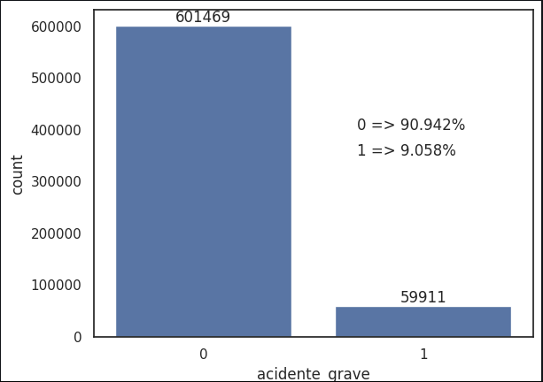
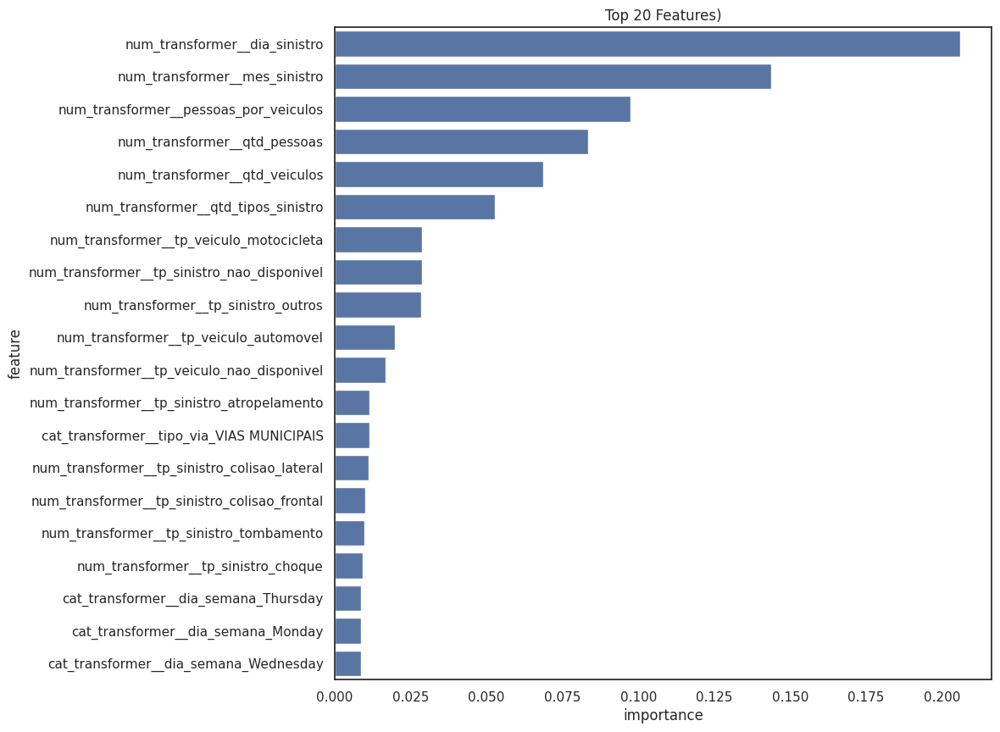
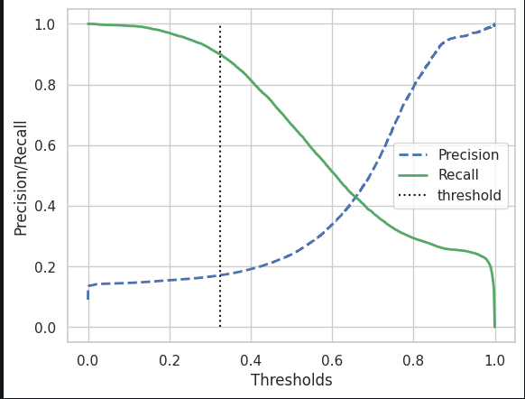
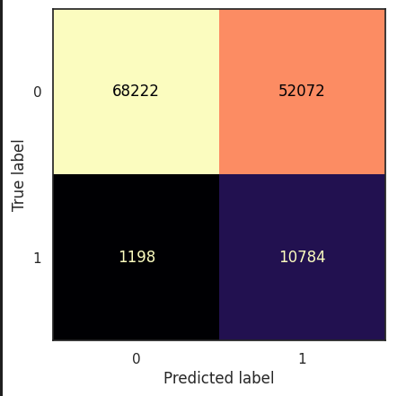

# Predição de Gravidade em Acidentes
## Introdução
Este projeto utiliza Machine Learning para prever a gravidade de acidentes em vias municipais e rodovias, classificando-os entre *'leves/não graves'* e *'graves/fatal'*.

 O objetivo principal é criar uma ferramenta de previsão, que, com base nas informações oferecidas sobre o acidente, auxilie na alocação de recursos de emergência e permita uma futura análise para identificação dos principais fatores que contribuem para a letalidade no trânsito de São Paulo.
## Setup
### Linguagem
- Python 3.13+

### Dependências
- **Manipulação de Dados**: Pandas, Numpy
- **Machine Learning**: Scikit-Learn
- **Visualização**: Matplotlib, Seaborn
- **Logs das Métricas**: mlflow

## Estrutura
```
predict_sinistro/
│
├── data_sample/ -> sample dos dados     
├── assets/      -> imagens para o README.md     
├── notebooks/   
│   ├── exploration.ipynb -> notebook com todo o passo-a-passo, raciocínio, gráficos      
├── src/                
│   ├── preprocess.py -> funções de limpeza e criação de colunas     
│   ├── predict.py -> aplicação com dados novos     
│   └── train.py -> todo o processo de treinamento (split, pipeline, modelo, logs das métricas)
├── README.md             
└── requirements.txt            
```
## Dados
Os dados utilizados neste projeto podem ser obtidos no Portal de Dados Abertos do Governo do Estado do São Paulo através do link a seguir:
https://dadosabertos.sp.gov.br/dataset/sinistros-infosiga.

O dataset usado para o treino possui 32134 linhas e 43 colunas. Ele contém informações dos anos de 2022 até 2025.

Como o objetivo é prever a gravidade de acidentes, o target escolhido foi a junção das colunas 'gravidade_grave' e 'gravidade_fatal', resultando na coluna 'acidente_grave', com os valores sendo 0 (não grave) ou 1 (grave/fatal). Os dados desta feature são desbalanceados, ou seja, praticamente 91% dos acidentes são não graves e apenas 9% são graves.


Para o treinamento do modelo será usadas apenas as features que possuem maior impacto para o resultado. Para obter as melhores foi utilizado o método *selectkbest* do módulo *feature_selection* da biblioteca *scikit-learn*.

## Modelo
O algoritmo utilizado foi o **Random Forest** pelo fato de que o modelo irá precisar lidar com dados desbalanceados, não-lineares, outliers, distribuições de cauda longa e assimetrias.
Por ele ser um método de ensemble, o risco de overfitting diminui, através da técnica de amostragens aleatórias, garantindo a generalização dos dados.

Foi utilizado GridSearchCV após o RandomizedSearchCV com a finalidade de achar os melhores hiperparâmetros, priorizando o f1-score, garantindo que o foco não esteja apenas no **Recall**, mas que o **Precision** tenha um valor aceitável.

Para uma otimização foi feito a escolha das 20 melhores features através do SelectKBest, removendo as que não possuem relevância para o modelo, fazendo com que a performance melhore.


## Resultados
|- | Baseline | Hiperparâmetros ajustados |
|:-|:-:|-:|
| Recall | 0.320 | 0.907|
| Precision | 0.490 | 0.177 |
| auc-pr | 0.460 | 0.522 |
| f1-score | 0.388 | 0.295

*Os valores da baseline possuem um threshold de 0.5

O auc-pr apesar de ser um valor baixo, para este modelo é um bom resultado, visto que os dados de resposta são desbalanceados (em torno de 90% de 0's para 10% de 1's)

O valor do threshold adotado foi aproximadamente 0.325 para que o recall pudesse se manter próximo de 0.9 e o precision não ser um valor tão baixo.


Manter o recall em 0.9 garante que 90% dos acidentes graves sejam identificados pelo modelo, porém ele estará certo apenas em 17.7% das previsões, ou seja, de 100 acidentes previstos, 17 serão graves.




## Reprodução
### Pré-requisitos
- Python 3.13+

### Instalações
```bash
pip install -r requirements.txt
```

### Como rodar
1. Iniciar o mlflow
```bash
mlflow ui
```
2. Rodar o código de treino
```bash
cd src
python3.13 train.py
```

3. Predição
    - Para conseguir utilizar o modelo treino, será necessário fazer seguir alguns passos:
        1. Acesse o http://localhost:5000, segurando a tecla Ctrl/Command clique com o botão esquerdo sobre o link.
        2. Na barra de navegação à esquerda, entre em 'Experiments'
        3. Selecione 'Sinistros' na coluna 'Name'
        4. Habilite a coluna 'Models' clicando em 'Columns' na barra de navegação da tabela
        5. Selecione 'model' na coluna 'Models'
        6. Clique em 'Register model', no canto superior direito
        7. Crie um novo modelo e nomeie de 'new_model'
    - Após seguir os passos basta mais um comando para gerar as predições
    ```bash
    python3.13 predict.py
    ```
    

## Observações
- Os dados usados no notebook são diferentes dos utilizados no train.py pois não foi possível carregar o CSV original por causa do limite de tamanho de arquivos que o github possui. Por esse motivo os resultados usando os dados disponibilizados para reprodução, muito provavelmente, serão diferentes dos resultados registrados neste README. Foi criado um sample para a reprodução do projeto. Originalmente o dataset tem 672524 linhas e 43 colunas, fazendo o modelo demorar em torno de 30 minutos nos treinos.
- Os dados usados no predict.py são dados novos, foram retirados de um dataset de períodos de análise diferentes um é de 2015-2012, outro de 2022-2025.